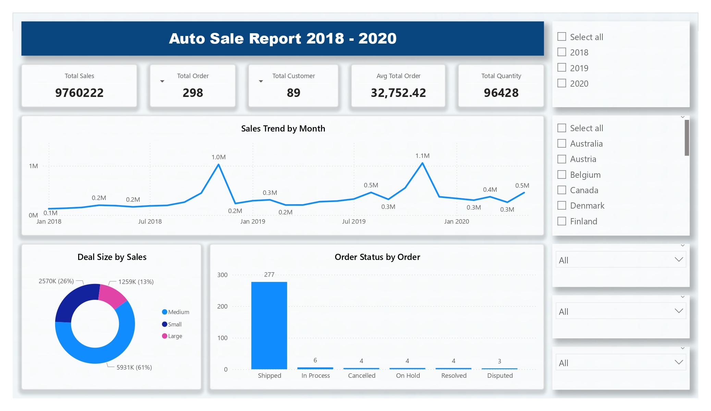

# Auto Sales Data Analysis Project

## Project Overview
The goal of this project is to transform raw sales data into meaningful business insights through data cleaning, SQL analysis, KPI calculation, and interactive dashboard visualization.

## Dashboard

## Dataset used
Total Records: 55,500 
<a href="auto-sales-data.csv" target="_blank">auto-sales-data.csv</a>  
Columns Included: 

1. Ordernumber
2. Quantityordered
3. Priceeach
4. Orderlinenumber
5. Sales
6. Orderdate
7. Days_Since_Lastorder
8. Status
9. Productline
10. Msrp
11. Productcode
12. Customername
13. Phone
14. Addressline1
15. City
16. Postalcode
17. Country
18. Contactlastname
19. Contactfirstname
20. Dealsize

## Business Questions Solved

<a href="Automobile-Sales-Dashboard.pdf" target="_blank">All Pages Automobile-Sales-Dashboard.pdf</a>  
 
1. Which product line generates the highest revenue?  
2. Who are the top 10 customers?  
3. What is the overall average order value?  
4. Which country contributes the most sales?  
5. How does revenue change month over month?

## Database 
<a href="Automobile_sales_database" target="_blank">Automobile_sales_database</a>  

## Process
Strong SQL fundamentals  
Data cleaning & transformation skills  
KPI design & business thinking  
Database schema design  
Analytical problem-solving  
Dashboard storytelling

## Project Insight
Identified top-performing customers contributing major revenue.  
Determined highest revenue-generating product lines.  
Observed seasonal sales trends.  
Measured customer purchasing behavior.  
Evaluated average revenue per order.

## Final Conclusion
This project demonstrates the ability to take raw business data and transform it into actionable insights using SQL and visualization tools. It highlights both technical proficiency and analytical thinking suitable for data analyst roles.

